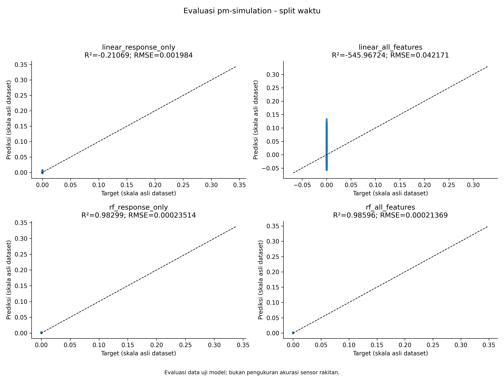
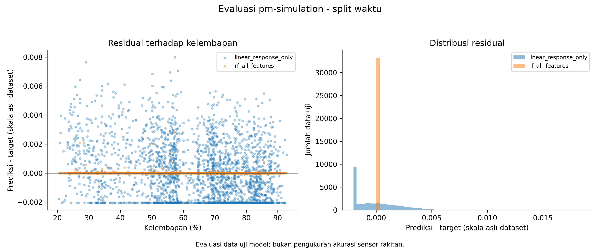
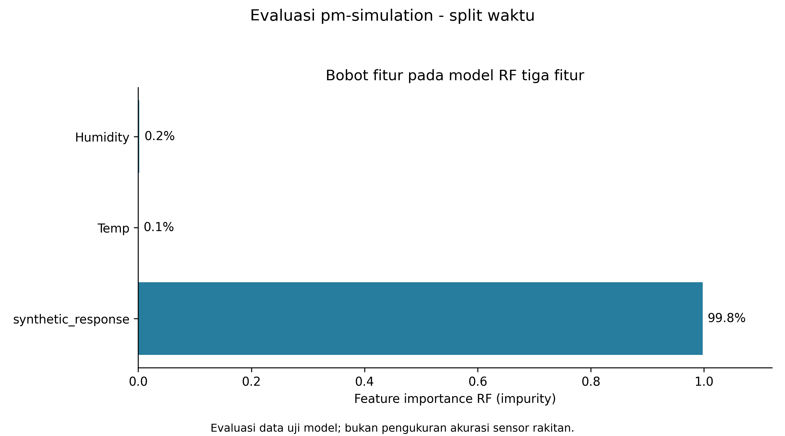
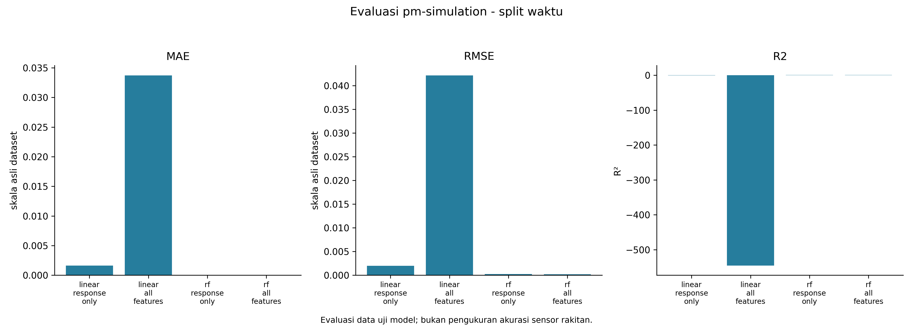

# Evaluasi pm-simulation - split waktu

original dataset numeric units (physical unit unresolved); synthetic experiment. Split waktu 80/20; baseline dan RF dilatih hanya pada bagian training. Header keluaran adalah kandidat benchmark, bukan pengganti otomatis firmware.

Satuan angka evaluasi: skala asli dataset.

| Model | MAE | RMSE | Bias | R² |
|---|---:|---:|---:|---:|
| linear_response_only | 0.0016396893 | 0.0019840238 | 2.5307254e-05 | -0.2106898 |
| linear_all_features | 0.033714377 | 0.042170727 | 0.0090481865 | -545.96724 |
| rf_response_only | 1.5725725e-05 | 0.00023514417 | 1.5725725e-05 | 0.98299379 |
| rf_all_features | 1.1905068e-05 | 0.00021368577 | 1.1905068e-05 | 0.98595602 |

CSV berisi seluruh 33,493 baris uji. Scatter menampilkan maksimal 2.500 baris yang dipilih merata menurut urutan data; metrik memakai seluruh baris.

[Prediksi CSV](test_predictions.csv) · [Metrik CSV](tabel_metrik_evaluasi.csv) · [Bobot fitur CSV](feature_importance.csv)

## Perbandingan sebelum dan sesudah ML

Pembanding: linear_all_features; model ML: rf_all_features. Keduanya dinilai pada data uji yang sama.

| Metrik | Pembanding | Setelah RF | Penurunan error |
|---|---:|---:|---:|
| RMSE | 0.042170727 | 0.00021368577 | 99.49% |
| MAE | 0.033714377 | 1.1905068e-05 | 99.96% |

Rumus: 100 × (error pembanding − error RF) / error pembanding. Nilai negatif berarti RF lebih buruk. Persentase ini adalah perubahan error pada eksperimen dataset, bukan persentase akurasi sensor fisik atau peningkatan firmware baru atas firmware lama.

[Unduh tabel perbandingan CSV](perbandingan_sebelum_sesudah.csv)
