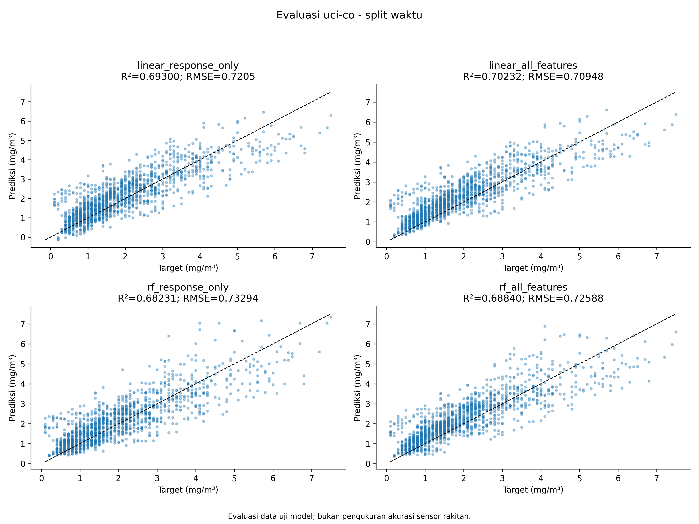
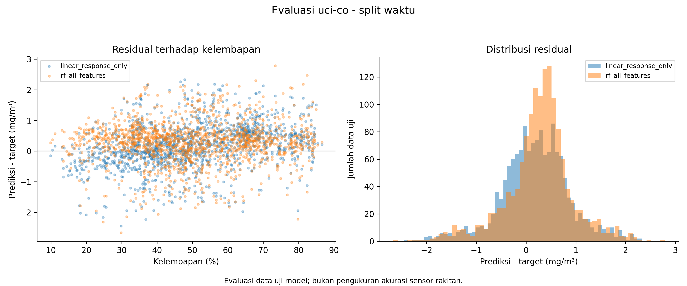
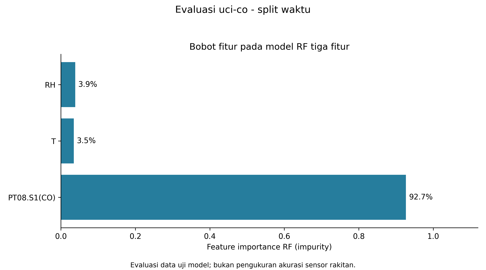
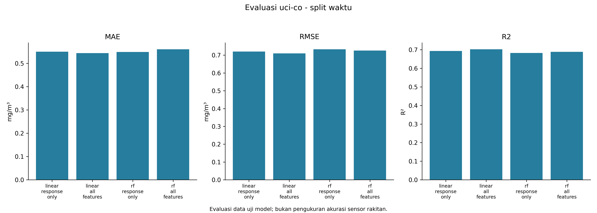

# Evaluasi uci-co - split waktu

mg/m3 (UCI reference analyzer); NOT MQ-7 calibration. Split waktu 80/20; baseline dan RF dilatih hanya pada bagian training. Header keluaran adalah kandidat benchmark, bukan pengganti otomatis firmware.

Satuan angka evaluasi: mg/m³.

| Model | MAE | RMSE | Bias | R² |
|---|---:|---:|---:|---:|
| linear_response_only | 0.54991101 | 0.72050374 | 0.17920374 | 0.69300096 |
| linear_all_features | 0.54388976 | 0.7094791 | 0.31832287 | 0.70232405 |
| rf_response_only | 0.54834667 | 0.73293983 | 0.1570265 | 0.68231172 |
| rf_all_features | 0.5602397 | 0.7258824 | 0.27092064 | 0.68840027 |

## Perbandingan sebelum dan sesudah ML

Pembanding: linear_all_features; model ML: rf_all_features. Keduanya dinilai pada data uji yang sama.

| Metrik | Pembanding | Setelah RF | Penurunan error |
|---|---:|---:|---:|
| RMSE | 0.7094791 | 0.7258824 | -2.31% |
| MAE | 0.54388976 | 0.5602397 | -3.01% |

Rumus: 100 × (error pembanding − error RF) / error pembanding. Nilai negatif berarti RF lebih buruk. Persentase ini adalah perubahan error pada eksperimen dataset, bukan persentase akurasi sensor fisik atau peningkatan firmware baru atas firmware lama.

[Unduh tabel perbandingan CSV](perbandingan_sebelum_sesudah.csv)

CSV berisi seluruh 1,469 baris uji. Scatter menampilkan maksimal 2.500 baris yang dipilih merata menurut urutan data; metrik memakai seluruh baris.

[Prediksi CSV](test_predictions.csv) · [Metrik CSV](tabel_metrik_evaluasi.csv) · [Bobot fitur CSV](feature_importance.csv)

