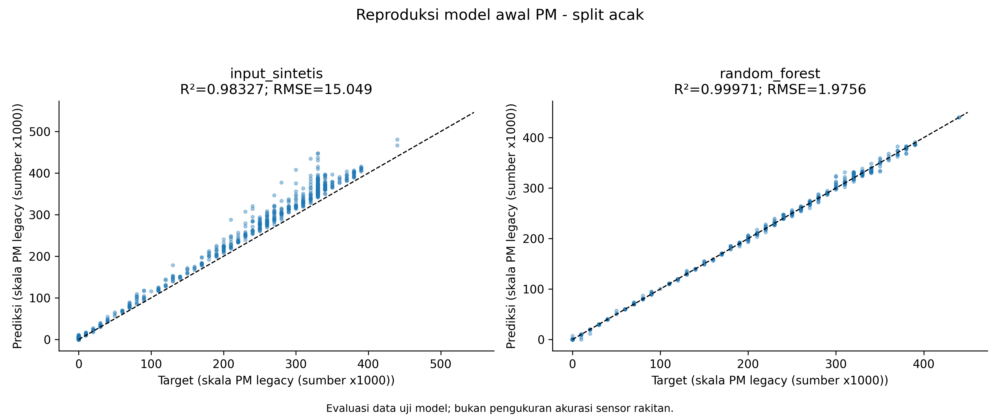
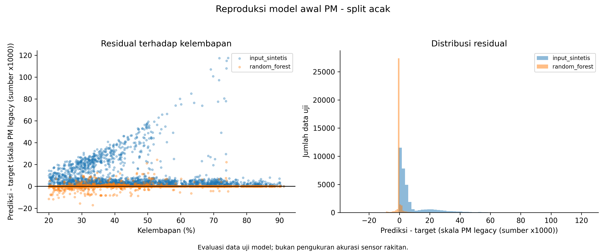
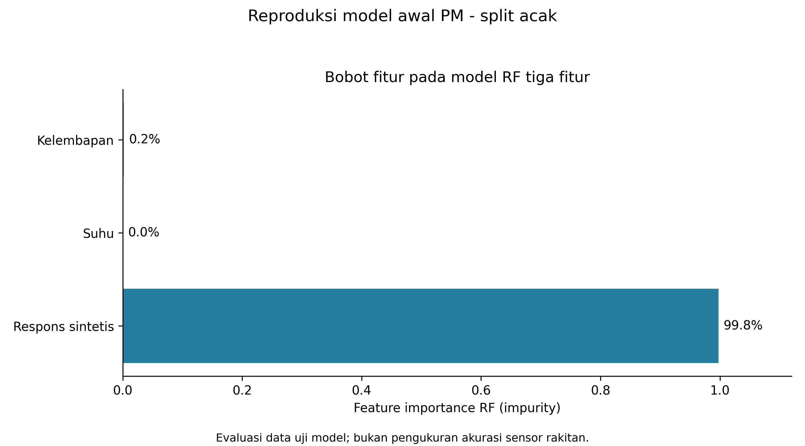
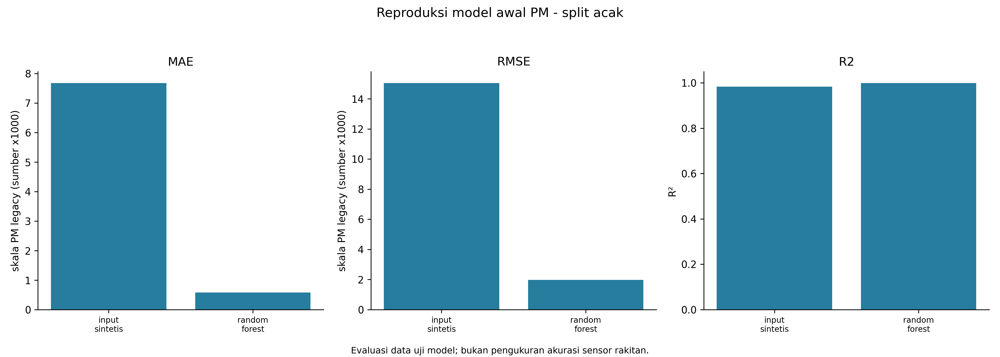

# Reproduksi model awal PM - split acak

Training RF mengikuti prosedur awal. PM memakai input sintetis dan skala legacy; CO memakai PT08 yang dipetakan. Baseline CO kini hanya fit training, sehingga dapat berbeda dari baseline arsip yang memakai seluruh data. Hasil ini bukan bukti kalibrasi sensor fisik dan tidak mengganti header firmware.

Satuan angka evaluasi: skala PM legacy (sumber x1000).

| Model | MAE | RMSE | Bias | R² |
|---|---:|---:|---:|---:|
| input_sintetis | 7.680122 | 15.049104 | 7.6786973 | 0.98327451 |
| random_forest | 0.58287981 | 1.9755523 | 0.015770797 | 0.99971177 |

## Perbandingan sebelum dan sesudah ML

Pembanding: input_sintetis; model ML: random_forest. Keduanya dinilai pada data uji yang sama.

| Metrik | Pembanding | Setelah RF | Penurunan error |
|---|---:|---:|---:|
| RMSE | 15.049104 | 1.9755523 | 86.87% |
| MAE | 7.680122 | 0.58287981 | 92.41% |

Rumus: 100 × (error pembanding − error RF) / error pembanding. Nilai negatif berarti RF lebih buruk. Persentase ini adalah perubahan error pada eksperimen dataset, bukan persentase akurasi sensor fisik atau peningkatan firmware baru atas firmware lama.

[Unduh tabel perbandingan CSV](perbandingan_sebelum_sesudah.csv)

CSV berisi seluruh 33,494 baris uji. Scatter menampilkan maksimal 2.500 baris yang dipilih merata menurut urutan data; metrik memakai seluruh baris.

[Prediksi CSV](test_predictions.csv) · [Metrik CSV](tabel_metrik_evaluasi.csv) · [Bobot fitur CSV](feature_importance.csv)

