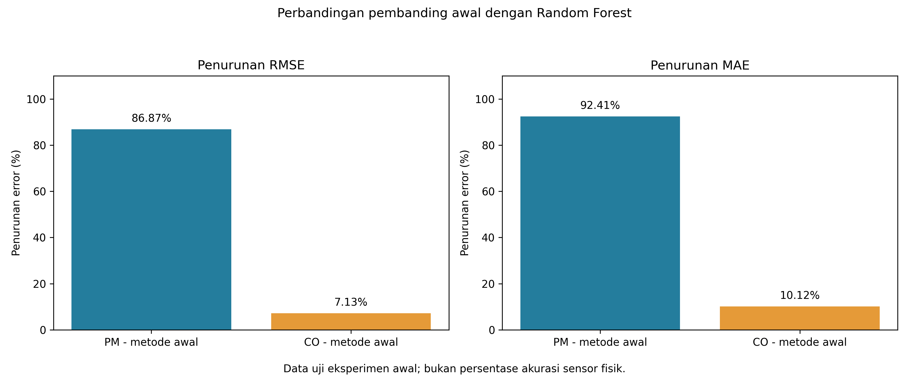

# Laporan utama evaluasi ML Stuzha

Mulai dari laporan ini. Tabel dan grafik ringkasan ada di folder yang sama; detail setiap eksperimen ada di hasil/. Berkas sebelum revisi disimpan satu kali di arsip/.

## Hasil seperti evaluasi awal

Pembanding PM adalah input sintetis sebelum dikoreksi RF. Pembanding CO adalah regresi linear satu input; sekarang dilatih hanya pada data training. RF memakai tiga input. Angka berikut dihitung ulang dari seluruh data uji, bukan dari angka yang sudah dibulatkan.

| Model | RMSE sebelum → RF | Error RMSE berkurang | MAE sebelum → RF | Error MAE berkurang | R² sebelum → RF |
|---|---:|---:|---:|---:|---:|
| PM - metode awal | 15.04910 → 1.97555 | 86.87% | 7.68012 → 0.58288 | 92.41% | 0.98327 → 0.99971 |
| CO - metode awal | 0.65802 → 0.61108 | 7.13% | 0.48437 → 0.43537 | 10.12% | 0.77814 → 0.80866 |

Rumus penurunan error: 100 × (sebelum − sesudah) / sebelum. Ini perbandingan pembanding dengan RF pada dataset uji, bukan model baru melawan model lama atau bukti sensor fisik lebih akurat sekian persen. PM mengikuti skala legacy sumber ×1000; CO memakai mg/m³.

[Tabel lengkap CSV](tabel_metrik_evaluasi.csv)

## Buka grafik dan data rinci

- [PM: prediksi, residual/kelembapan, bobot fitur, metrik](hasil/reproduksi_awal_20260909_124230_faba1c/pm/laporan_evaluasi_metrik.md)
- [CO: prediksi, residual/kelembapan, bobot fitur, metrik](hasil/reproduksi_awal_20260909_124230_faba1c/co/laporan_evaluasi_metrik.md)

## Evaluasi tambahan dengan split waktu

Eksperimen ini berbeda dari metode awal sehingga persentasenya tidak boleh dibandingkan langsung dengan tabel di atas. Pembanding di bawah adalah linear tiga fitur melawan RF tiga fitur, keduanya fit training dan diuji pada waktu sesudahnya.

| Eksperimen | Penurunan RMSE | Penurunan MAE |
|---|---:|---:|
| PM - split waktu | 99.49% | 99.96% |
| CO - split waktu | -2.31% | -3.01% |

Nilai negatif berarti RF lebih buruk. Pada CO split waktu, RF tidak mengungguli pembanding linear. Penurunan besar PM terhadap linear juga dipengaruhi buruknya prediksi linear pada distribusi waktu uji; lihat seluruh empat model pada laporan rinci.

[Detail evaluasi split waktu](hasil/evaluasi_20260909_124246_f546a8/laporan_evaluasi_metrik.md)

## Arsip dan model firmware

[CSV awal](arsip/sebelum_revisi/tabel_metrik_evaluasi.csv) dan [laporan arsip](arsip/sebelum_revisi/laporan_evaluasi_metrik.md) dipertahankan. Grafik lama berada di arsip/sebelum_revisi/grafik/. Label lama tidak diubah. Hasil baru di atas tidak mengganti header firmware aktif.
