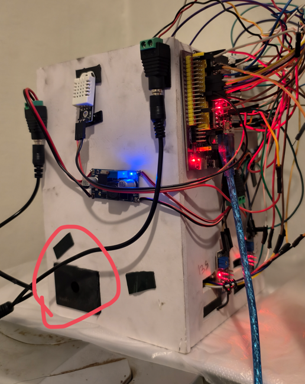
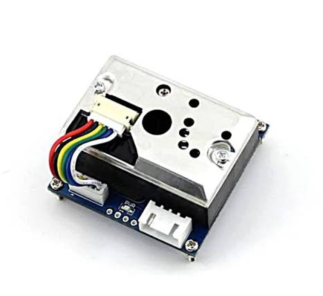

# 🛠️ Desain Hardware, Blueprint, Skematik & Galeri Prototipe — Project Stuzha

Dokumentasi visual dan teknis mengenai arsitektur fisik purwarupa **Smart Air Purifier & Real-Time ISPU Monitoring System** (Project Stuzha). Folder ini disiapkan sebagai wadah arsip gambar blueprint, skematik rangkaian kelistrikan, serta foto dokumentasi perangkat fisik untuk kebutuhan artikel jurnal ilmiah.

---

## 📂 1. Struktur Folder Hardware

```text
Hardware/
├── README.md                              # Dokumentasi teknis, dimensi, & daftar foto
├── foto_alat/                             # Galeri foto fisik prototipe alat nyata
│   ├── prototipe_fisik_tampak_samping.png # Foto unit purifier (ESP32, DHT22, Step-Down, GP2Y)
│   ├── sensor_gp2y1010_modul.png          # Foto modul sensor Sharp GP2Y1010AU0F
│   └── (tambahkan foto-foto lain di sini)
├── skematik/                              # Gambar skematik Fritzing / EasyEDA / KiCAD
│   └── (simpan diagram wiring / skematik di sini)
└── blueprint/                             # Gambar desain 2D/3D bodi box, dimensi, CAD
    └── (simpan blueprint bodi box & duct di sini)
```

---

## 📐 2. Blueprint & Dimensi Mekanikal Box

Purwarupa mengusung bentuk **Menara Vertikal (*Vertical Standing Tower*)** yang mengintegrasikan ruang penempatan sensor (*sensing chamber*), modul filtrasi, dan unit pendorong udara aksial.

```text
       ┌─────────────────────────────┐
       │   EXHAUST FAN (12x12 cm)    │  <-- Hembusan Udara Bersih ke Atas
       │   12V 1.65A ~6.200 RPM      │
       ├─────────────────────────────┤
       │                             │
       │     FILTER (HEPA / MESH)    │  <-- Media Penyaring Partikulat Debu
       │                             │
       ├─────────────────────────────┤
       │                             │  <-- ESP32, Step-Down, & Kabel
       │   RONGGA SENSOR (CHAMBER)   │  <-- Udara Panas Sensor MOS Naik Bebas
       │   DHT22 | MQ-7 | MQ-135     │
       │                             │
       │ [GP2Y INTAKE PORT (10 mm)]  │  <-- Hisapan Udara Ruangan Masuk
       └─────────────────────────────┘
              ▲               ▲
          Kaki Box         Kaki Box
```

### Spesifikasi Bodi Mekanikal:
* **Dimensi Lubang Kipas (Duct Port):** Bukaan kotak presisi **$12\text{ cm} \times 12\text{ cm}$ ($120\text{ mm} \times 120\text{ mm}$)** dibuat dengan rasio $1:1$ mengikuti dimensi luar frame kipas aksial untuk mencegah penyempitan aliran (*constriction*), meniadakan turbulensi udara pada sudut kotak, dan memaksimalkan laju aliran volumetrik (CFM).
* **Orientasi Operasional: Wajib Posisi Berdiri Tegak (Vertikal):**
  1. *Proteksi Optik Sensor Debu (Sharp GP2Y1010AU0F):* Mencegah partikel debu gravitasi kasar mengendap dan menumpuk pada lensa pemancar inframerah dan fototransistor.
  2. *Manajemen Termal Sensor Gas:* Panas dari koil pemanas sensor MQ-7 dan MQ-135 secara alami naik ke atas (*natural upward chimney convection*) dan langsung terbuang, mencegah panas terperangkap memanaskan sensor suhu/kelembapan DHT22 dan optik debu.
  3. *Pola Sirkulasi Kamar:* Udara dihisap dari celah samping/bawah, melewati media filter dan sensor, lalu dihembuskan keluar secara aksial ke atas.
* **Orientasi Pemasangan Sensor GP2Y1010AU0F:**
  * **Sisi Kaleng Besi (*Metal Shield*):** Diletakkan di **SISI DALAM BOX**. Bertindak sebagai pelindung interferensi elektromagnetik (*EMI Shielding*) terhadap sirkuit penguat fotodioda dari derau listrik modul step-down dan ESP32, serta mengamankan konektor soket kabel pelangi 6-pin di dalam box.
  * **Sisi Plastik Hitam:** Menghadap ke **SISI LUAR BOX**. Lubang silinder $10\text{ mm}$ bertindak sebagai corong hisap udara kamar langsung (*air intake nozzle*).

---

## ⚡ 3. Skematik Rangkaian & Wiring Pinout

Sistem ditenagai oleh catu daya ganda yang diturunkan melalui modul regulator efisiensi tinggi:

```text
+12V DC Adapter ──────┬───────────────────────────────> (+) Kipas Industri 12V 1.65A
                      │                                       │
                      │                                   [Transistor NPN / Driver]
                      │                                       ▲ (Gate/Base)
                      │                                       │
                      │                           GPIO 19 ────┴── [PWM Signal 25 kHz]
                      │
                      ▼
               [Buck Converter 5V] ──┬─────────> VIN ESP32
                                     ├─────────> VCC Sensor MQ-7 (Koil Pemanas 5V)
                                     ├─────────> VCC Sensor MQ-135
                                     ├─────────> VCC Sensor Sharp GP2Y1010 (Pin 1 & 3)
                                     └─────────> VCC Sensor DHT22 (3.3V - 5V)
GND (Common Ground) ──┴──────────────┴─────────> Seluruh GND Sensor, Mikrokontroler, & Kipas
```

### Tabel Koneksi Pin ESP32 (Wajib Sesuai Firmware)

| Komponen Hardware | Pin ESP32 | Tipe Jalur | Keterangan Fungsi |
|---|:---:|:---:|---|
| **Sharp GP2Y1010AU0F (Vo)** | **GPIO 34** | ADC1 Input | Membaca tegangan analog hamburan optik debu |
| **Sharp GP2Y1010AU0F (ILED)**| **GPIO 5** | Digital Out | Mengirim pulsa drive LED inframerah ($0.28\text{ ms}$ aktif LOW) |
| **MQ-7 (Gas CO)** | **GPIO 32** | ADC1 Input | Membaca resistansi analog sensor Karbon Monoksida |
| **MQ-135 (VOC/Campuran)** | **GPIO 33** | ADC1 Input | Indikator proksi gas campuran sekunder |
| **DHT22 (AM2302)** | **GPIO 4** | Digital I/O | Membaca suhu lingkungan (°C) dan kelembapan (RH%) |
| **Kipas DC (PWM Control)** | **GPIO 19** | LEDC PWM | Mengatur kecepatan putaran kipas berjenjang (13%, 15%, 22%, 50%, 85%) |
| **Industrial Buzzer** | **GPIO 18** | Tone / PWM | Peringatan audio alarm saat polutan mencapai kategori Berbahaya |

---

## 📸 4. Galeri Foto Prototipe Alat

Berikut dokumentasi fisik unit purwarupa Project Stuzha:

### A. Prototipe Fisik Tampak Samping (Chassis & Wiring Luar)
Menampilkan penempatan sensor DHT22 (atas), modul penurun tegangan (*buck converter* biru), modul mikrokontroler ESP32 di papan ekspansi terminal, serta **lubang intake hisap sensor GP2Y1010AU0F (lingkaran merah di kiri bawah)**:



---

### B. Modul Sensor Partikulat Sharp GP2Y1010AU0F
Menampilkan modul sensor dengan plat seng pelindung (*metal can shield*), lubang terowongan optik $10\text{ mm}$, serta konektor soket 6-pin yang dipasang menghadap ke dalam bodi boks:



---

### C. Foto Tambahan Tim (Slot Tersedia)
Silakan simpan file foto tambahan di folder `Hardware/foto_alat/` dan tautkan di bawah ini:
* **Tampak Depan Bodi Box:** ``
* **Tampak Dalam (Chamber Filter & Kipas 12x12 cm):** ``
* **Detail Sambungan Bawah / Exhaust Atas:** ``

---

## 📝 5. Panduan Tim untuk Menambahkan Foto & Skematik Baru

Untuk anggota tim (*Daffa, Garnie, Riq-Z*):
1. **Menambahkan Foto:**
   * Ambil foto yang jelas (pencahayaan terang, fokus tajam).
   * Beri nama file deskriptif tanpa spasi, contoh: `tampak_depan_purifier.jpg` atau `skematik_wiring_fritzing.png`.
   * Simpan file gambar di dalam folder:
     - Foto fisik alat $\rightarrow$ `Hardware/foto_alat/`
     - Gambar skematik / wiring $\rightarrow$ `Hardware/skematik/`
     - Gambar desain 2D/3D bodi $\rightarrow$ `Hardware/blueprint/`
2. **Menampilkan di Dokumen:**
   * Buka file ini ([`Hardware/README.md`](README.md)), tambahkan baris sintaks Markdown:
     ```markdown
     
     ```
3. **Commit & Push ke GitHub:**
   ```bash
   git add Hardware/
   git commit -m "docs(hardware): add photos and schematics"
   git push origin main
   ```

---
*© 2026 Project Stuzha — Tim Riset Kualitas Udara Cerdas IoT & TinyML.*
