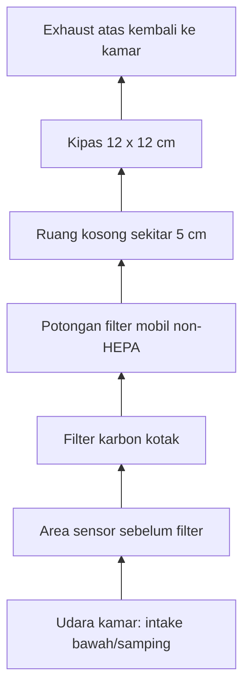
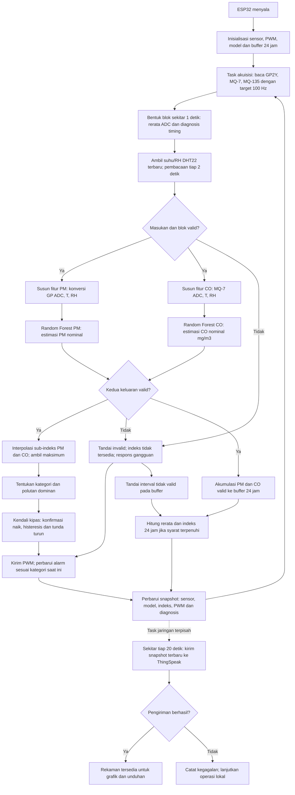

# Cara Kerja, Peran TinyML, dan Flowchart Project Stuzha

**Dokumen penjelasan untuk dosen pembimbing — 16 September 2026.**

Disusun dengan mencocokkan dokumentasi dan kode firmware v4.0.0 di repositori. Acuan identitas deployment: build `a945ea070fcc`, pasangan model `d7f32c60`. Dokumen ini menjelaskan implementasi yang ada; pembuatannya tidak mengubah firmware, model, atau data penelitian.

## 1. Gambaran paling sederhana

Stuzha adalah prototipe monitoring udara indoor berbiaya rendah. Sensor membaca kondisi udara, ESP32 menjalankan dua model Random Forest untuk menghasilkan estimasi PM dan CO, lalu rumus interpolasi menghitung sub-indeks masing-masing. Nilai sub-indeks terbesar menjadi indeks estimasi gabungan yang menentukan kategori dan perintah kipas. Data dikirim ke ThingSpeak untuk ditampilkan dan disimpan.

**Urutan utamanya:**

```text
GP2Y + suhu + kelembapan → model ML PM → estimasi PM → sub-indeks PM ─┐
                                                                  ├→ nilai maksimum
MQ-7 + suhu + kelembapan → model ML CO → estimasi CO → sub-indeks CO ─┘
                                                                       ↓
                                                            kategori estimasi
                                                                       ↓
                                                        logika kipas dan alarm

MQ-135 → ADC gas campuran → pencatatan pendukung di ThingSpeak
```

ML berjalan **di dalam ESP32**, sehingga estimasi dan kendali lokal tetap berlangsung tanpa internet. ThingSpeak menerima hasil; ThingSpeak tidak menjalankan kedua model tersebut.

Dalam penelitian saat ini, PM dan CO merupakan **estimasi nominal eksperimental**: angka dan satuannya mengikuti kontrak model yang digunakan, tetapi ketepatan konsentrasi pada alat fisik belum dibuktikan dengan instrumen pembanding. Indeksnya disebut **indeks estimasi berbasis tabel ISPU**, bukan ISPU resmi atau penetapan bahwa udara pasti aman. Bagian 6 menjelaskan alasan teknisnya.

## 2. Komponen dan perannya

| Komponen | Yang dibaca/dilakukan | Peran dalam sistem | Pin ESP32 |
|---|---|---|---|
| GP2Y1010AU0F | Sinyal analog optik yang merespons partikel | Masukan utama model PM; tidak langsung menghasilkan ISPU | Vo GPIO 34, penggerak LED GPIO 5 |
| MQ-7 | Sinyal analog sensor gas | Masukan utama model CO | GPIO 32 |
| DHT22 | Suhu dalam °C dan kelembapan relatif/RH dalam % | Dua fitur tambahan pada **kedua** model ML | GPIO 4 |
| MQ-135 | Sinyal analog gas campuran | Indikator pendukung/proksi perubahan gas atau VOC; disimpan sebagai ADC | GPIO 33 |
| Kipas 12 × 12 cm | Menerima perintah PWM | Aktuator pendukung respons terhadap kategori estimasi | GPIO 19 |
| Buzzer | Bunyi berkala | Alarm ketika kategori estimasi tinggi dan syarat kendali terpenuhi | GPIO 18 |
| ESP32 `esp32dev` | Akuisisi, inferensi, perhitungan, kendali, komunikasi | Pusat pemrosesan lokal | — |
| ThingSpeak | Menerima rekaman melalui Wi-Fi | Grafik dan arsip telemetri | — |

**MQ-135 tidak masuk ke Random Forest PM/CO dan tidak ikut menentukan nilai maksimum ISPU pada versi ini.** Nilainya bukan konsentrasi VOC/TVOC terkalibrasi. DHT22 justru digunakan langsung oleh kedua model, bukan hanya ditampilkan di dashboard.

## 3. Jalur udara dan jalur data

Rakitan memakai casing gabus keras. Sensor berada di area intake sebelum filter; GP2Y menghadap horizontal dan MQ-7 dipasang tegak di bagian bawah. Susunan aliran yang didokumentasikan adalah:



Ini adalah jalur udara rancangan ketika kipas mendapat daya dan berputar. Sensor mengamati udara sebelum filter, sehingga satu kelompok sensor ini tidak mengukur efisiensi sebelum-versus-sesudah filter secara langsung.

Suplai 12 V digunakan untuk kipas dan expansion board; expansion menyediakan jalur 5 V. Pengaturan siklus pemanas MQ-7 belum terverifikasi. Angka suplai 5 V saja tidak menjelaskan apakah siklus pemanas khusus MQ-7 telah dijalankan.

Menurut catatan pemilik selama pengujian, daya motor kipas sebagian besar dilepas dan hanya dinyalakan pada beberapa kesempatan. Karena firmware tidak membaca RPM, PWM yang tercatat tetap merupakan **perintah putaran**, bukan bukti kipas benar-benar berputar. Kondisi ini harus dicantumkan ketika menjelaskan hasil penelitian.

## 4. Flowchart pemrosesan firmware



Panah kembali menggambarkan pengulangan sistem. Dalam implementasinya, akuisisi dan jaringan berjalan sebagai task terpisah, sehingga pembacaan sensor tidak menunggu respons ThingSpeak.

### 4.1 Akuisisi sensor dan pembentukan satu blok

Target periode pembacaan analog adalah 10 ms, setara 100 pembacaan per detik. Pada setiap siklus GP2Y:

1. ESP32 mengaktifkan LED sensor dengan logika LOW.
2. Setelah sekitar 280 µs, ESP32 memulai pembacaan ADC GP2Y.
3. LED dinonaktifkan setelah durasi pulsa ditargetkan sekitar 320 µs; keterlambatan aktual dipantau.
4. ESP32 membaca ADC MQ-7 dan MQ-135.
5. Sekitar satu detik pembacaan dikumpulkan menjadi satu blok.

Untuk setiap sensor analog, fitur berikutnya memakai rerata ADC dalam blok:

$$
\overline{A}=\frac{1}{N}\sum_{i=1}^{N}A_i
$$

`A_i` adalah satu pembacaan ADC, sedangkan `N` biasanya sekitar 100. Karena dirata-ratakan, ADC yang disimpan dapat memiliki desimal walaupun pembacaan individual berupa bilangan bulat 0–4095.

Firmware mencatat jumlah sampel, kejadian ADC menyentuh batas, dan penyimpangan timing. Blok dengan jumlah sampel di luar 90–110, terlalu lama diproses (>2,5 detik), atau penyimpangan timing melebihi 10% sampel tidak dipakai sebagai masukan model valid. Pembacaan DHT22 yang tidak valid juga membuat inferensi tidak valid; program tidak menggantinya dengan suhu/RH buatan.

### 4.2 Jadwal kerja yang berbeda

| Proses | Interval/target | Artinya |
|---|---|---|
| Akuisisi analog | 10 ms / 100 Hz | Mengumpulkan pembacaan sensor |
| Pembentukan blok, inferensi dan kendali | Sekitar 1 detik | Memperbarui estimasi dan keputusan lokal |
| Pembacaan DHT22 | Sekitar 2 detik | Nilai terbaru dipakai kembali di antara pembacaan |
| Pengiriman ThingSpeak | Sekitar 20 detik | Mengirim snapshot terakhir, bukan seluruh data per detik |
| Pembaruan ringkasan 24 jam | Pada batas menit | Menghitung jendela waktu yang telah lengkap |

Jadi, jeda grafik ThingSpeak 20 detik **tidak membuat kipas harus menunggu 20 detik**. Snapshot cloud juga bukan rerata 20 detik dan tidak merekam semua perubahan singkat.

## 5. Dari ADC masuk ke model: rumus yang benar-benar dipakai

### 5.1 Jalur GP2Y → model PM

Firmware terlebih dahulu membentuk tegangan nominal dari rerata ADC:

$$
V_{nom}=\overline{A}_{GP}\frac{3.3}{4095}
$$

Kemudian membentuk fitur debu historis:

$$
P_{input}=\max\left(0,\left(0.17V_{nom}-0.1\right)\times1000\right)
$$

Fitur yang masuk ke model PM, dengan urutan tetap, adalah:

$$
\mathbf{x}_{PM}=[P_{input},T,RH]
$$

`P_input` **belum merupakan keluaran akhir ML**. Model PM masih memproses tiga fitur tersebut untuk menghasilkan `P_hat`.

Konstanta 0,17, −0,1 dan ×1000 di atas adalah praproses historis yang dipertahankan dalam kode. Dokumen ini tidak menyatakannya sebagai hasil kalibrasi rakitan atau rumus universal datasheet. Firmware juga menghitung tegangan pin melalui fasilitas kalibrasi ADC ESP32 untuk diagnosis, tetapi nilai diagnosis itu tidak menggantikan rumus masukan model di atas.

### 5.2 Jalur MQ-7 → model CO

Model CO menerima rerata ADC MQ-7 secara langsung bersama suhu dan RH:

$$
\mathbf{x}_{CO}=[\overline{A}_{MQ7},T,RH]
$$

Keluaran model adalah `C_hat` pada skala nominal **mg/m³**, mengikuti target pelatihan historis. Firmware ini tidak menghitung CO menggunakan rangkaian rumus resistansi `Rs/R0` dari kurva datasheet MQ-7.

### 5.3 Cara Random Forest menghasilkan angka

Ada **dua model regresi terpisah**, masing-masing berisi 30 pohon keputusan. Setiap pohon membaca tiga fitur, membandingkannya dengan ambang yang tersimpan, lalu memilih sebuah daun yang berisi angka prediksi. Hasil model adalah rerata prediksi semua pohon:

$$
\hat y(\mathbf{x})=\frac{1}{30}\sum_{j=1}^{30}f_j(\mathbf{x})
$$

Dengan demikian:

$$
\hat P=RF_{PM}(P_{input},T,RH),\qquad
\hat C_{mg}=RF_{CO}(\overline{A}_{MQ7},T,RH)
$$

Suhu dan kelembapan dapat mengubah cabang pohon yang dipilih sehingga prediksi dapat berubah walaupun ADC utama sama. Besarnya pengaruh tersebut bergantung pada isi model yang telah dilatih. Tidak ada satu rumus linear tunggal yang menggantikan seluruh pohon.

### 5.4 Konversi CO untuk tampilan dan perhitungan indeks

Untuk grafik, CO ditampilkan dalam ppm pada kondisi referensi tetap 25 °C dan 1 atm:

$$
k=\frac{28.01\times101325}{8.314462618\times298.15\times1000}
\approx1.145\;\frac{mg/m^3}{ppm}
$$

$$
\hat C_{ppm}=\frac{\hat C_{mg}}{k}
$$

Sementara itu, tabel CO untuk perhitungan sub-indeks menggunakan µg/m³:

$$
\hat C_{\mu g}=1000\hat C_{mg}
$$

Jadi **angka ppm pada grafik tidak langsung dimasukkan ke tabel CO µg/m³**. Konversi tampilan memakai suhu referensi tetap; DHT22 berperan sebagai fitur model, bukan pengubah kondisi referensi satuan setiap saat.

## 6. ML di sini untuk apa, dan dilatih di mana?

**Fungsi ML adalah mengubah masukan sensor utama beserta suhu/RH menjadi estimasi polutan yang kemudian benar-benar digunakan oleh perhitungan indeks dan kendali.** Ini adalah implementasi estimator berbasis beberapa masukan atau *soft sensor*. Istilah TinyML menjelaskan bahwa model tersebut dijalankan pada mikrokontroler dengan sumber daya terbatas.

Pembagian pekerjaannya:

| Bagian | Tugas |
|---|---|
| Sensor | Menghasilkan sinyal kondisi lingkungan |
| Praproses | Merata-ratakan ADC dan menyusun fitur |
| Random Forest | Menghasilkan estimasi numerik PM dan CO |
| Rumus interpolasi | Mengubah estimasi polutan menjadi sub-indeks |
| Operasi maksimum dan tabel kategori | Memilih indeks dominan dan kategori |
| Controller | Mengatur PWM dan alarm dengan aturan waktu/histeresis |

**ML tidak memprediksi kategori secara langsung**, tidak dilatih ulang di ESP32, dan tidak otomatis makin akurat setelah alat menyala tujuh hari.

### 6.1 Pelatihan berbeda dengan inferensi


Diagram ini menjelaskan proses umum sampai deployment. Pada repositori sekarang, header historis `model_pm.h` dan `model_co.h` tetap menjadi model aktif. Model kandidat hasil evaluasi baru disimpan terpisah dan tidak otomatis mengganti model aktif.

### 6.2 Asal model aktif dan cara menyatakannya kepada pembimbing

| Model | Asal pembentukan model historis | Implikasi untuk penjelasan penelitian |
|---|---|---|
| PM | Memakai data publik PM, T, RH; pelatihan historis mengalikan target PM dengan 1000 dan membentuk masukan PM terganggu secara sintetis berdasarkan T/RH serta noise | Model menunjukkan pemetaan yang dipelajari dalam eksperimen tersebut. Skala PM deployment belum terverifikasi secara fisik; hasil simulasi bukan bukti koreksi sensor ruangan |
| CO | Target `CO(GT)` dari UCI dalam mg/m³; fitur respons `PT08.S1` dipetakan ke rentang 800–3600, disertai T/RH | Sensor `PT08.S1` bukan MQ-7. Kesamaan rentang angka ADC tidak membuktikan kesamaan respons sensor |

Tujuan desain awal penggunaan T/RH adalah membantu estimasi ketika respons sensor dipengaruhi lingkungan. Namun, **keberhasilan mengoreksi drift atau meningkatkan akurasi fisik belum dapat disimpulkan dari model aktif ini**. Bukti yang sudah dapat diteliti adalah berjalannya inferensi pada ESP32, keterhubungan hasil model dengan indeks/kendali, latensi, kestabilan operasi, serta rekaman sensor dan diagnosisnya.

Untuk pembimbing, rumusan yang sesuai adalah: **“TinyML berfungsi sebagai estimator eksperimental PM dan CO berbasis sensor fusion; penelitian ini mengevaluasi implementasi dan operasi prototipe, sedangkan validasi kalibrasi fisik merupakan tahap terpisah.”**

## 7. Estimasi polutan → sub-indeks → maksimum → kategori

### 7.1 Titik interpolasi dalam firmware

Titik batas konsentrasi mengikuti tabel pada Lampiran I [Permen LHK P.14 Tahun 2020](https://ppkl.menlhk.go.id/website/filebox/988/210704011643PERMEN%20ISPU%20NO%2014%20TAHUN%202020.pdf). Titik nol ditambahkan dalam implementasi sebagai awal interpolasi.

| Titik indeks | PM2.5 (µg/m³) | CO (µg/m³) |
|---:|---:|---:|
| 0 | 0 | 0 |
| 50 | 15,5 | 4.000 |
| 100 | 55,4 | 8.000 |
| 200 | 150,4 | 15.000 |
| 300 | 250,4 | 30.000 |
| 500 | 500 | 45.000 |

Tabel regulasi menggunakan basis pengukuran 24 jam untuk kedua parameter tersebut. Firmware menyediakan **dua keluaran berbeda**: penerapan tabel pada estimasi terbaru untuk kendali cepat, dan penerapan tabel pada rerata estimasi 24 jam. Penggunaan tabel yang sama tidak membuat indeks sesaat menjadi pengukuran ISPU resmi.

### 7.2 Rumus interpolasi linear

Untuk konsentrasi `C` yang berada di antara batas bawah `X_b` dan batas atas `X_a`:

$$
I=I_b+\frac{I_a-I_b}{X_a-X_b}(C-X_b)
$$

- `I_b` dan `I_a`: indeks pada batas bawah dan atas.
- `X_b` dan `X_a`: konsentrasi pada batas bawah dan atas.
- `C`: keluaran model setelah satuannya disesuaikan.

Rumus dijalankan terpisah untuk PM dan CO:

$$
I_{PM}=g_{PM}(\hat P),\qquad I_{CO}=g_{CO}(1000\hat C_{mg})
$$

Lalu:

$$
I_{instan}=\max(I_{PM},I_{CO})
$$

Parameter dengan sub-indeks terbesar dicatat sebagai dominan. Jika sama, ditandai seimbang. Karena perangkat hanya memakai dua parameter untuk indeks, hasil ini adalah maksimum dari **PM dan CO saja**, bukan evaluasi seluruh parameter polutan dalam regulasi.

Jika salah satu estimasi tidak valid, indeks gabungan tidak tersedia; masukan hilang tidak diganti nol. Jika konsentrasi melewati titik tertinggi tabel, indeks dibatasi 500 dan flag `INDEX_ABOVE_RANGE` disimpan agar kondisi tersebut tetap dapat dikenali.

### 7.3 Penentuan kategori dalam kode

Firmware membulatkan indeks ke bilangan bulat terdekat sebelum menentukan kategori. Nilai desimalnya tetap dapat dikirim ke cloud.

| Indeks setelah pembulatan | Kode kategori | Nama kategori estimasi |
|---|---:|---|
| 0–50 | 1 | Baik |
| 51–100 | 2 | Sedang |
| 101–200 | 3 | Tidak Sehat |
| 201–300 | 4 | Sangat Tidak Sehat |
| >300, dengan keluaran dibatasi 500 | 5 | Berbahaya |
| Tidak valid/tidak tersedia | 0 | Tidak tersedia |

Nilai nol dimasukkan ke kategori 1 oleh implementasi. Nama kategori mengikuti rujukan ISPU, tetapi pada Stuzha selalu dibaca sebagai **kategori estimasi model**. AQI adalah istilah umum indeks kualitas udara; tabel yang dipakai di sini adalah tabel ISPU Indonesia, bukan tabel US EPA AQI.

### 7.4 Contoh hitungan sampai kipas

**Contoh ilustrasi, bukan hasil pengukuran atau hasil prediksi dari ADC tertentu.** Misalkan model telah menghasilkan:

- PM nominal = 31,4 µg/m³.
- CO nominal = 4 mg/m³ = 4.000 µg/m³, atau sekitar 3,49 ppm pada kondisi referensi tampilan.

PM berada di antara 15,5 dan 55,4 µg/m³:

$$
I_{PM}=50+\frac{100-50}{55.4-15.5}(31.4-15.5)
\approx69.92
$$

CO tepat berada pada titik indeks 50:

$$
I_{CO}=50,\qquad I_{instan}=\max(69.92,50)=69.92
$$

Indeks dibulatkan menjadi 70 untuk kategori → **Sedang**, dengan PM sebagai parameter dominan. Target kipas menjadi level 2. Jika sebelumnya level 1, kenaikan menunggu konfirmasi sekitar satu detik; jika sebelumnya lebih tinggi, penurunan mengikuti aturan histeresis dan penundaan, bukan langsung turun ke level 2.

## 8. Dari kategori ke PWM kipas dan buzzer

### 8.1 Lima tingkat perintah kipas

PWM kipas menggunakan resolusi 8 bit dan frekuensi 25 kHz. Persentase dihitung sebagai:

$$
PWM_{\%}=\frac{duty}{255}\times100
$$

| Target kategori | Level | Duty (0–255) | Perintah PWM sebenarnya |
|---|---:|---:|---:|
| Baik | 1 | 33 | 12,94% ≈ 13% |
| Sedang | 2 | 38 | 14,90% ≈ 15% |
| Tidak Sehat | 3 | 56 | 21,96% ≈ 22% |
| Sangat Tidak Sehat | 4 | 128 | 50,20% ≈ 50% |
| Berbahaya | 5 | 217 | 85,10% ≈ 85% |

Persentase ini adalah duty sinyal, bukan persentase RPM atau debit udara. Level awal saat boot adalah level 1. Tidak ada pembentukan baseline konsentrasi baru setiap boot.

### 8.2 Menghindari kipas naik-turun terlalu cepat

**Saat naik:** kategori yang lebih tinggi harus terkonfirmasi selama sedikitnya sekitar 1 detik pada pembaruan berurutan. Lonjakan yang lebih tinggi tidak boleh meminjam seluruh waktu konfirmasi kategori yang lebih rendah.

**Saat turun:** indeks harus berada di bawah 95% ambang bawah level sekarang selama sedikitnya 8 detik. Kipas kemudian turun satu tingkat. Contoh batas turun:

| Transisi turun | Indeks harus berada di bawah | Lama konfirmasi |
|---|---:|---:|
| Level 2 → 1 | 47,5 | 8 detik |
| Level 3 → 2 | 95 | 8 detik |
| Level 4 → 3 | 190 | 8 detik |
| Level 5 → 4 | 285 | 8 detik |

Histeresis berarti batas untuk turun berbeda dari batas untuk naik. Penundaan berarti kondisi tersebut harus bertahan, sehingga noise di sekitar batas tidak langsung mengganti level. Jeda pembaruan lebih dari 2,5 detik mereset hitungan konfirmasi.

### 8.3 Alarm dan respons gangguan

Buzzer aktif jika kategori valid saat ini minimal 4 dan level kipas minimal 4. Bunyinya berupa pulsa sekitar 100 ms, paling sering sekali setiap 5 detik. Ketika kategori saat ini turun, alarm berhenti walaupun kipas masih menunggu waktu penurunan.

Saat masukan/model tidak valid, controller memerintahkan minimal level 4; level 5 yang sudah aktif tidak diturunkan oleh kondisi invalid. Jika rerata ADC GP2Y jenuh (≥4094), controller memerintahkan level 5. Respons gangguan ini tidak membunyikan alarm polusi dan tidak menganggap ADC jenuh sebagai konsentrasi PM tertentu.

Karena itu, **PWM tinggi bisa berasal dari kategori tinggi atau respons gangguan**. Interpretasi grafik harus membaca flag dan kategori bersama PWM. Buzzer dan kipas memakai kanal LEDC terpisah: kipas kanal 0, buzzer kanal 15.

## 9. Rerata dan indeks 24 jam

Selain jalur instan untuk kendali, ESP32 menyimpan akumulasi estimasi dalam buffer RAM berisi 1.440 bagian menit. Nilai rata-rata dihitung dengan bobot durasi data valid:

$$
\overline P_{24}=\frac{\sum_i\hat P_i\Delta t_i}{\sum_i\Delta t_i},\qquad
\overline C_{24}=\frac{\sum_i\hat C_i\Delta t_i}{\sum_i\Delta t_i}
$$

$$
Coverage=\frac{\text{durasi valid dalam jendela}}{86.400\;detik}\times100\%
$$

Implementasi memakai nilai valid sebelumnya untuk interval pendek sampai pembaruan berikutnya; jeda lebih dari 1,5 detik tidak diisi ulang dengan nilai lama. Ringkasan dihitung pada batas menit untuk jendela yang telah lengkap.

Rerata dan indeks 24 jam tersedia setelah sedikitnya 24 jam sejak boot dan cakupan waktu valid minimal 75%. Ambang 75% ini adalah kebijakan kelengkapan dalam firmware, bukan pernyataan bahwa seluruh persyaratan pengukuran resmi telah terpenuhi.

$$
I_{24}=\max\left(g_{PM}(\overline P_{24}),g_{CO}(1000\overline C_{24})\right)
$$

**Urutannya adalah merata-ratakan estimasi polutan, lalu menghitung indeks. Bukan merata-ratakan semua indeks instan.** Sebelum syarat terpenuhi, keluaran 24 jam ditandai belum tersedia. Buffer tetap berjalan saat Wi-Fi mati selama ESP32 menyala, tetapi hilang saat perangkat restart karena disimpan di RAM.

## 10. Data apa yang dikirim ke ThingSpeak?

Kontrak data aktif bernama **STZ4**:

| Field | Isi | Keterangan |
|---:|---|---|
| 1 | Suhu | °C dari DHT22 |
| 2 | RH | % dari DHT22 |
| 3 | Estimasi PM nominal | Keluaran model PM, label skala µg/m³ nominal |
| 4 | Estimasi CO nominal | Keluaran model CO yang dikonversi ke ppm |
| 5 | Indeks estimasi instan | Maksimum sub-indeks PM dan CO |
| 6 | PWM kipas | Persentase perintah duty |
| 7 | MQ-135 ADC | Rerata ADC gas campuran |
| 8 | Kode kategori estimasi | 1–5; 0 jika tidak tersedia |

String `status` menyimpan konteks tambahan agar data dapat ditelusuri:

- `a`: rerata ADC GP2Y dan MQ-7 sebelum model.
- `d`: rerata PM 24 jam, rerata CO 24 jam **dalam mg/m³**, indeks 24 jam, dan coverage.
- `v`, `h`, `m`, `b`: versi firmware, identitas build, identitas model, dan boot ID.
- `u`, `s`: uptime dan urutan blok akuisisi.
- `i`: durasi eksekusi inferensi dalam µs; bukan interval sampling atau latensi internet.
- `f`, `n`, `j`: flag diagnosis, jumlah sampel blok, dan jumlah kejadian timing menyimpang.
- Informasi lain mencakup level, parameter dominan, counter pengiriman dan sisa heap.

Raw ADC disimpan supaya perubahan keluaran model dapat dibandingkan dengan masukan aslinya. Flag juga menandai asumsi skala PM, transfer model CO dan status heater MQ-7 yang belum terverifikasi.

Task jaringan mengirim snapshot terbaru sekitar setiap 20 detik. Jika router/internet mati, akuisisi, inferensi dan kontrol lokal tetap berjalan. Namun, versi ini tidak memiliki arsip offline persisten untuk mengirim ulang semua snapshot yang terlewat. Gap cloud harus dilaporkan sebagai gap, bukan diisi angka normal.

## 11. Hubungannya dengan pengujian tujuh hari dan naskah

Pengujian tujuh hari bertujuan mengamati **operasi prototipe**: kesinambungan sesi, reset yang teramati, kelengkapan telemetri, timing dan latensi, kondisi invalid, perubahan sensor/estimasi, serta keputusan PWM. Rekaman ini tidak otomatis menjadi dataset kalibrasi karena belum memiliki konsentrasi referensi berpasangan.

Untuk hasil dan pembahasan, tampilkan alur yang sama dengan dokumen ini: masukan GP2Y/MQ-7 dan T/RH → keluaran ML → indeks/kategori → perintah PWM. Hubungkan perubahan dengan catatan AC, aktivitas, gangguan sensor, daya kipas dan koneksi internet. Intervensi seperti jari masuk ke area optik tetap dipertahankan dalam data dan diberi keterangan jika waktunya diketahui; jangan menganggap semua lonjakan adalah polusi atau semua lonjakan akibat jari.

Pada bagian kipas, gunakan istilah **evaluasi perintah aktuator** untuk interval ketika daya motor dilepas. Pengujian tersebut tetap memberi data monitoring dan keputusan controller, tetapi tidak menunjukkan efek putaran kipas atau kemampuan pembersihan udara pada interval itu.

### Paragraf ringkas untuk penjelasan kepada pembimbing

> Project Stuzha merupakan prototipe monitoring kualitas udara indoor berbasis ESP32. Sinyal GP2Y dan MQ-7 dirata-ratakan dalam blok sekitar satu detik, kemudian masing-masing dipadukan dengan suhu dan kelembapan DHT22 sebagai masukan dua model Random Forest yang dijalankan langsung pada mikrokontroler. Keluaran model berupa estimasi nominal PM dan CO dikonversi menjadi sub-indeks menggunakan interpolasi tabel Permen LHK P.14 Tahun 2020. Sub-indeks terbesar menentukan indeks estimasi instan dan kategorinya, yang selanjutnya digunakan untuk mengatur perintah PWM kipas dengan histeresis dan penundaan perubahan level. MQ-135 menjadi indikator gas campuran pendukung. Data dan diagnosis dikirim ke ThingSpeak sekitar setiap 20 detik, sedangkan rerata dan indeks estimasi 24 jam dihitung terpisah di ESP32. Penelitian mengevaluasi implementasi TinyML dan kestabilan monitoring; validasi konsentrasi sensor serta efisiensi filtrasi tidak disimpulkan dari pengujian operasi ini.

## 12. Peta sumber untuk pemeriksaan teknis

| Bagian penjelasan | Sumber repositori |
|---|---|
| Rakitan, daya dan posisi komponen | [Dokumentasi hardware](../Hardware/hardware_stuzha.md) |
| Akuisisi, task, validasi, inferensi dan pengiriman | [main.cpp](../Program/Kode/src/main.cpp) |
| Praproses dan masukan dua model | [experimental_models.h](../Program/Kode/include/experimental_models.h) |
| Pohon model aktif | [model_pm.h](../Program/Kode/include/model_pm.h), [model_co.h](../Program/Kode/include/model_co.h) |
| Interpolasi, konversi CO, maksimum dan kategori | [ispu_calc.h](../Program/Kode/include/ispu_calc.h) |
| Histeresis dan waktu perubahan level aktif | [ispu_control.h](../Program/Kode/include/ispu_control.h) |
| Rerata berbobot waktu dan buffer 24 jam | [rolling_ispu.h](../Program/Kode/include/rolling_ispu.h) |
| Kontrak firmware dan field | [Dokumentasi firmware](../Program/Kode/firmware_stuzha.md) |
| Metode dan keputusan model | [Metode ISPU v4](metode_ispu_v4.md), [Keputusan finalisasi ML](keputusan_finalisasi_ml_stuzha.md) |
| Rekonstruksi praproses pelatihan historis | [audit_legacy_training.py](../ml_training/audit_legacy_training.py) |
| Kondisi aktual daya kipas selama studi | [Catatan sesi 6, bagian kondisi fisik](catatan_audit_astra_sesi6.md) |
| Rancangan pengambilan dan analisis data | [Protokol tujuh hari](protokol_pengambilan_data_7_hari.md) |

Rujukan eksternal untuk tabel dan asal data: [Permen LHK P.14/2020, Lampiran I](https://ppkl.menlhk.go.id/website/filebox/988/210704011643PERMEN%20ISPU%20NO%2014%20TAHUN%202020.pdf), [dataset PM Mendeley](https://data.mendeley.com/datasets/2r232jpfb2/1), dan [UCI Air Quality](https://archive.ics.uci.edu/dataset/360/air+quality). Sumber dataset menjelaskan asal data pelatihan, bukan sertifikat kalibrasi rakitan Stuzha.
