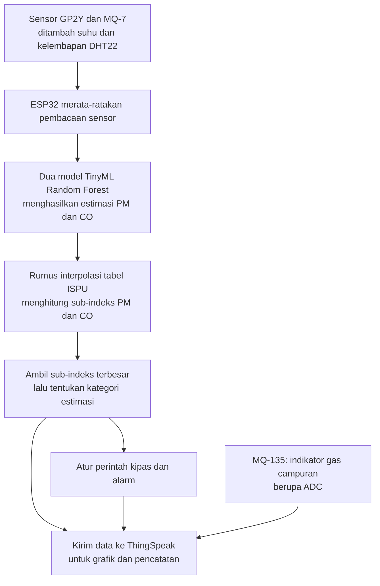

# Cara Kerja Singkat Project Stuzha

Stuzha adalah prototipe monitoring udara dalam ruangan. ESP32 membaca sensor, menjalankan model ML untuk memperkirakan PM dan CO, menghitung indeks estimasi berdasarkan tabel ISPU, lalu mengatur kipas dan mengirim data ke ThingSpeak.

## Flowchart sederhana



## Urutan kerjanya

1. **Sensor membaca udara.** GP2Y merespons partikel, MQ-7 merespons gas, dan DHT22 membaca suhu serta kelembapan. MQ-135 menjadi indikator gas campuran pendukung.
2. **ESP32 menyiapkan masukan.** Pembacaan analog dirata-ratakan sekitar setiap satu detik. Nilai GP2Y dikonversi dengan rumus praproses yang tersimpan sebelum masuk model PM.
3. **ML menghasilkan estimasi.** Model PM menerima nilai GP2Y, suhu, dan kelembapan. Model CO menerima ADC MQ-7, suhu, dan kelembapan. Keduanya berjalan langsung di ESP32.
4. **Rumus menghitung indeks.** Estimasi PM dan CO masing-masing diubah menjadi sub-indeks menggunakan interpolasi tabel ISPU. **Nilai terbesar dipilih**, kemudian ditentukan kategorinya: Baik, Sedang, Tidak Sehat, Sangat Tidak Sehat, atau Berbahaya.
5. **Controller mengatur kipas.** Target PWM bertingkat sekitar **13%, 15%, 22%, 50%, dan 85%**. Kenaikan dikonfirmasi sekitar satu detik; penurunan menunggu delapan detik per tingkat dengan batas penurunan berbeda agar kipas tidak mudah naik-turun. Alarm mengikuti kategori tinggi yang valid.
6. **Data dicatat.** ThingSpeak menerima snapshot sekitar setiap 20 detik. Pemrosesan lokal tetap berjalan sekitar setiap satu detik, sehingga kipas tidak menunggu pengiriman cloud.

## ML di sini buat apa?

**ML mengolah sinyal sensor bersama suhu dan kelembapan menjadi estimasi PM dan CO.** Jadi, hasil ML benar-benar menjadi masukan perhitungan indeks dan kendali kipas.

```text
Model PM: GP2Y + suhu + kelembapan → estimasi PM
Model CO: MQ-7 + suhu + kelembapan → estimasi CO

Estimasi PM → sub-indeks PM ─┐
                           ├→ ambil terbesar → kategori → kipas
Estimasi CO → sub-indeks CO ─┘
```

Model sudah dilatih di komputer dan disimpan dalam firmware. ESP32 menggunakan model tersebut untuk prediksi; alat tidak belajar ulang otomatis selama pengujian tujuh hari. MQ-135 tidak masuk ke kedua model dan tidak ikut menghitung indeks.

## Contoh paling sederhana

Misalkan setelah keluaran ML dihitung dengan rumus ISPU, diperoleh:

- Sub-indeks PM = **70**.
- Sub-indeks CO = **50**.

Sistem memilih **70**, sehingga kategori estimasinya **Sedang** dan target kipas sekitar **15%**, mengikuti aturan waktu perubahan level. Ini contoh ilustrasi, bukan hasil pengukuran tertentu.

## Catatan untuk pembimbing

Hasil saat ini disebut **estimasi eksperimental**, karena skala model PM dan penerapan model CO pada MQ-7 belum tervalidasi dengan alat pembanding. Tabel ISPU digunakan sebagai dasar perhitungan; indeks sesaat ini bukan ISPU resmi. Rerata dan indeks estimasi 24 jam dihitung terpisah.

Pengujian tujuh hari menilai kestabilan monitoring, inferensi ML, pengiriman data, dan keputusan controller. PWM yang tercatat adalah **perintah kipas**; saat daya motor dilepas, angka tersebut tidak menunjukkan kipas benar-benar berputar.

Rumus lengkap, rincian model, sumber kode dan referensi tersedia pada [penjelasan detail Stuzha](cara_kerja_dan_flowchart_stuzha.md).
